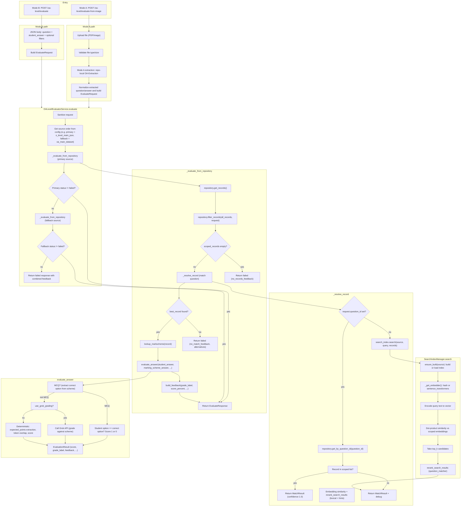
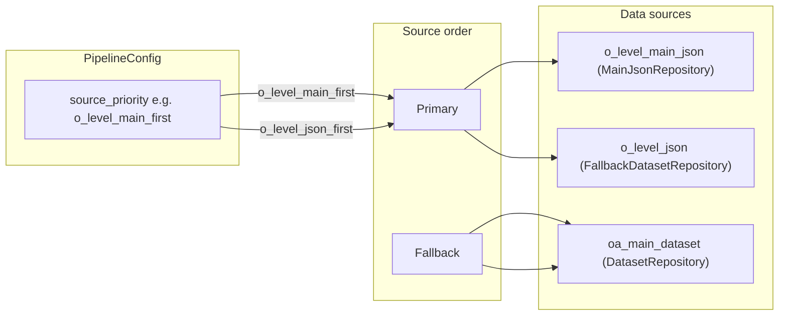
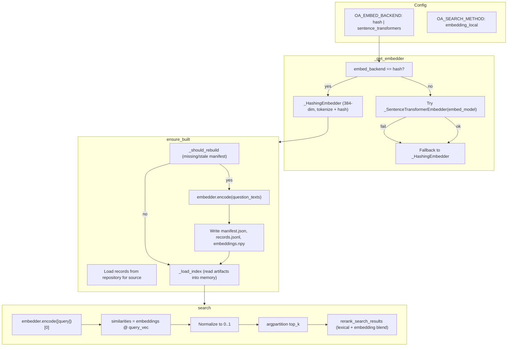
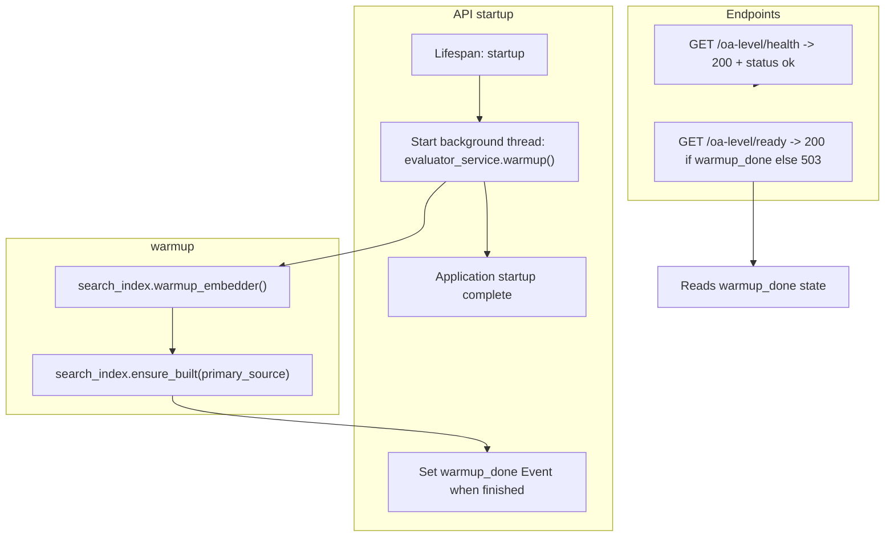

# O/A Levels Evaluator Pipeline – Flow

## High-level flow

## Data sources and source order

## Search index (embedding path)

## Startup and readiness

## Different wording / paraphrasing

The pipeline does **not** require the question to be exactly the same as in the dataset. It can match when the question has the same meaning but different wording, depending on the embedding backend and thresholds.

**How matching works**

1. **Embedding similarity (75% of final score)**  
   The query question and each dataset question are turned into vectors; similarity is dot product (normalized).  
   - **With `OA_EMBED_BACKEND=sentence_transformers`**: Embeddings are semantic. Paraphrased questions (same meaning, different words) often get **high** similarity, so the pipeline can still match and grade correctly.  
   - **With `OA_EMBED_BACKEND=hash`**: Vectors are built from tokens (words). Different wording means different tokens, so similarity drops. Matching works best when the user’s question shares a lot of words with the dataset question.

2. **Lexical overlap (20%)**  
   Jaccard similarity on token sets. Same wording gives 1.0; paraphrasing reduces overlap, so this score is lower when wording is very different.

3. **Answer hint (5%)**  
   Small bonus when the student answer aligns with the marking scheme (e.g. same MCQ option).

**Thresholds (config)**

- `search_accepted_threshold` (default 0.78): best match above this → status `accepted`.
- `search_review_threshold` (default 0.62): above this but below accepted → `review_required`; below → `failed`.

**Practical takeaway**

- **Same meaning, different wording**: Use **sentence_transformers** (default or with a pre-downloaded model). The pipeline is designed to work in this case.  
- **Hash backend**: Prefer when you care about fast startup and no HF; matching is more sensitive to wording and works best when the question text is close to the dataset (e.g. same key phrases).  
- If paraphrased questions often get `review_required` or `failed`, you can lower `OA_SEARCH_ACCEPTED_THRESHOLD` (e.g. 0.72) or `OA_SEARCH_REVIEW_THRESHOLD` (e.g. 0.55), at the cost of more false positives.

---

## File and component reference

| Step | File / component |
|------|-------------------|
| API entry (Mode A/B) | [oa_main_pipeline/api.py](oa_main_pipeline/api.py) |
| OCR / extraction (Mode A) | [oa_main_pipeline/mode_a_oa_extraction.py](oa_main_pipeline/mode_a_oa_extraction.py) + [OA-Extraction/src/oa_extraction/pipeline.py](OA-Extraction/src/oa_extraction/pipeline.py) |
| Orchestration | [oa_main_pipeline/service.py](oa_main_pipeline/service.py) – `OALevelEvaluatorService.evaluate`, `_evaluate_from_repository`, `_resolve_record` |
| Repositories | `MainJsonRepository`, `DatasetRepository`, `FallbackDatasetRepository` |
| Search index | [oa_main_pipeline/search_index.py](oa_main_pipeline/search_index.py) – `SearchIndexManager.search`, `ensure_built`, `_get_embedder` |
| Rerank / match | [oa_main_pipeline/question_matcher.py](oa_main_pipeline/question_matcher.py) – `rerank_search_results` |
| Markscheme | [oa_main_pipeline/markscheme_lookup.py](oa_main_pipeline/markscheme_lookup.py) – `lookup_markscheme` |
| Grading | [oa_main_pipeline/answer_evaluator.py](oa_main_pipeline/answer_evaluator.py) – `evaluate_answer` (Grok or deterministic) |
| Feedback | [oa_main_pipeline/feedback_builder.py](oa_main_pipeline/feedback_builder.py) – `build_feedback` |
| Config | [oa_main_pipeline/config.py](oa_main_pipeline/config.py) – `PipelineConfig` |
