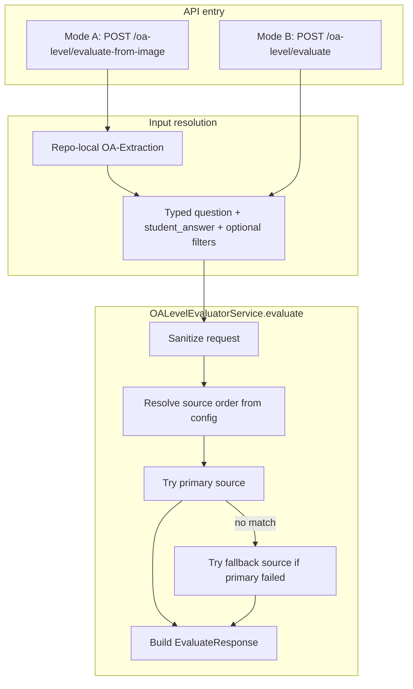

# O/A Levels Evaluator Pipeline Flow

## High-Level Flow

## API Modes

| Mode | Endpoint | Input |
|------|----------|-------|
| Mode A | `POST /oa-level/evaluate-from-image` | File upload (PDF/image) + optional filters + `page_number` |
| Mode A preview | `POST /oa-level/evaluate-from-image/preview` | File upload (PDF/image) + optional filters + `page_number` |
| Mode A confirm | `POST /oa-level/evaluate-from-image/confirm` | Confirmed/edited extracted text |
| Mode B | `POST /oa-level/evaluate` | JSON question + student answer + optional filters |

- Mode A validates the upload, runs the repo-local OA-Extraction adapter, normalizes the extracted question/answer text, then evaluates against the dataset.
- Mode B skips extraction and directly evaluates the typed question/answer pair.

## Mode A Notes

- The FastAPI layer lives in [oa_main_pipeline/api.py](../oa_main_pipeline/api.py).
- The app-side adapter lives in [oa_main_pipeline/mode_a_oa_extraction.py](../oa_main_pipeline/mode_a_oa_extraction.py).
- The extraction backend lives in [OA-Extraction/src/oa_extraction/pipeline.py](../OA-Extraction/src/oa_extraction/pipeline.py).
- Preview keeps the existing public response contract, but its extraction/debug fields now come from OA-Extraction diagnostics rather than the retired local Grok recovery pipeline.
